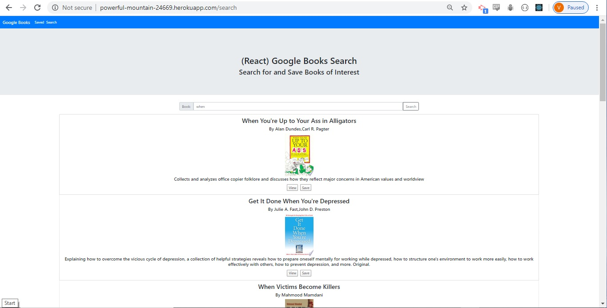

This is a mern stack application which lets you search for books using the google books. The results of the search can be saved. React is used to make it a single page application which behaves like it has two pages. One page is used to display the saved book information. Each entry has a link to its google book page and a delete button that can be used to delete that entry. The second page is the search page which lets you enter a search term and displays the top 10 results from the google books api. Each item of the results has a save button which lets you save that books information in a mongodb database.

[Github Repo](https://github.com/vadimsusername/earchs-oogleg-ooksb)

[Heroku Deployment](https://powerful-mountain-24669.herokuapp.com/)

